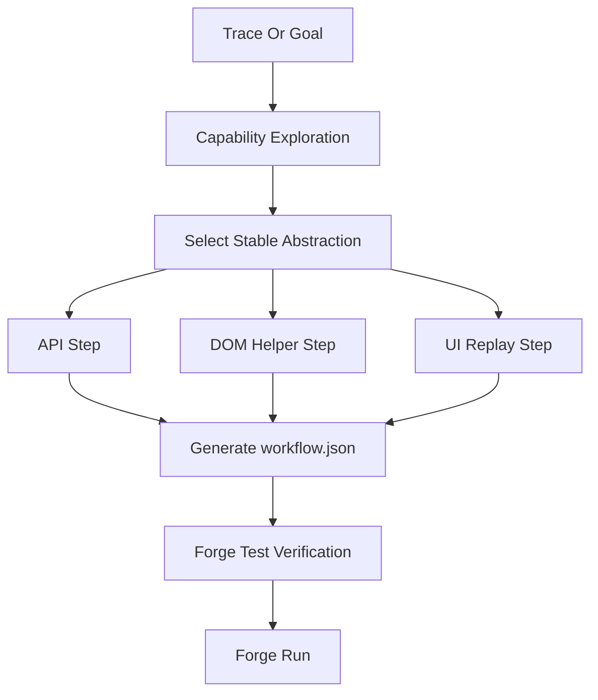

# Forge API-First 与 Replay 可靠性优化修改文档

## 背景

这次 Wayfair WSP Product Report 任务暴露了当前 Forge 的核心短板：我们已经把 `workflow.json`、参数绑定、artifact contract、`forge run` 做出来了，但生成阶段过早固化了 UI 动作链。结果是产物看起来很工程化，实际复跑却在普通表单控件上失败。

同一个任务用 BrowserAct Skill Forge 跑出的路径更稳定。它没有固化 `click WSP -> click Product Report -> select Day -> pick date -> click Generate`，而是先通过网络和 HAR 找到页面背后的 report proxy：

- 创建报告：`POST /a/media_hub/report/proxy`，内部 `path = /partner/v1/reports`，`method = POST`
- 查询报告：`POST /a/media_hub/report/proxy`，内部 `path = /partner/v1/reports`，`method = GET`
- 下载报告：`POST /a/media_hub/report/proxy`，内部 `path = /partner/v1/reports/{id}/download`，`method = GET`

BrowserAct 的强点不是单个 click 更准，而是先选择更稳定的抽象层。我们要吸收的是这个 API-first capability discovery 机制，而不是照搬它的 skill 文档格式。

相关材料：

- `docs/BROWSERACT_SKILL_FORGE_WAYFAIR_COMPARISON.md`
- `.agents/skills/wayfair-ads-product-report/SKILL.md`
- `.bao/skills/wayfair-ads-product-report/evidence/workflow.json`
- `.bao/skills/wayfair-ads-product-report/evidence/generation-report.json`
- `.bao/skills/wayfair-ads-product-report/evidence/repair-suggestion.json`
- `output/wayfair-wsp-product-report-browseract-forge/wayfair-wsp-product-report/SKILL.md`

## 当前问题

### 1. 生成流程默认走 trace replay

当前 `bao forge generate` 的主要路径是从已录制动作生成 replay workflow：

1. 读取 trace events。
2. 生成语义 locator。
3. 生成 replay steps。
4. 抽取参数。
5. 补 artifact contract。
6. 生成 `SKILL.md` 和 `workflow.json`。

这个流程在简单页面上可用，但对现代 SPA 里的复杂组件不够稳定。它容易把临时 UI 状态固化成“主路径”，例如 Wayfair 的 Downshift 下拉框、日历、React controlled input。

### 2. helper 执行成功不等于业务成功

Wayfair 失败链路里，`Product Report` helper 返回了：

```json
{"error": true}
```

但 replay 仍把这个 step 标记为成功，因为浏览器成功执行了 JS。真实业务失败被延迟到后面的 `click Day` 才暴露，导致 repair suggestion 聚焦在 Day locator，而不是前置 helper 的业务失败。

这类问题会让系统误判根因。

### 3. UI widget 被拆成脆弱动作链

当前 workflow 主路径包含：

- `click Group Data By`
- `click Day inside dialog None Day Week Month`
- `select Custom Date Range`
- `open Start Date date picker`
- `select calendar day`
- `open End Date date picker`
- `select calendar day`

这些不是业务动作，而是特定 UI 实现细节。它们会受到弹层渲染、焦点、遮挡、滚动、网络时序影响。

### 4. 生成报告不解释“为什么选这个抽象层”

现在 `generation-report.json` 能报告 step 数量、locator 覆盖、参数、artifact，但缺少一个关键问题的答案：

为什么这个任务应该用 UI replay，而不是 API call 或 DOM helper？

没有这个解释，Forge 就只能在动作链层面修补，而不能从根上切换到更稳定的能力层。

### 5. artifact 已经是我们的优势，但还需要大文件路径

我们已经有 artifact contract，这是比 BrowserAct Skill Forge 更产品化的地方。BrowserAct 这次下载 CSV 是把文件 base64 放进 eval 输出，短期有效，但大文件会有 stdout 截断和内存风险。

我们的方向应该是继续强化 workflow artifact runtime，把下载、落盘、校验放进 `forge run`，而不是把大文件塞进 JSON 返回。

## 目标架构

新的 Forge 生成链路应该从“动作复放优先”改为“稳定抽象优先”。



抽象层优先级：

1. API capability：请求结构透明、能在登录浏览器上下文复现。
2. Network capture capability：请求不透明，但可由页面触发并从网络读取结果。
3. DOM helper capability：页面 JS 必须参与，但控件可脚本化。
4. UI action replay：没有更稳定路径时的最后 fallback。

核心原则：

- `workflow.json` 仍然是我们执行的 source of truth。
- API、DOM helper、UI replay 都是 workflow step 类型。
- `SKILL.md` 只是人类说明，不再承担实际执行语义。
- `forge run` 直接执行 workflow，解析参数、捕获 outputs、保存 artifacts、返回 validators。

## P0 修改项

### P0-1：把 API-first discovery 放到 Forge 主流程前

要改什么：

- 在 `forge generate` 进入 `workflow.json` 生成前，新增 capability exploration 阶段。
- 对目标页面读取 `xhr/fetch` 网络请求、HAR、请求体、响应结构。
- 识别是否存在可复现的内部接口。
- API 透明时优先生成 API capability step。
- API 不透明或不可复现时才进入 DOM helper / UI replay。

怎么改：

- 新增模块：`src/browser_auto_ops/forge/capability.py`。
- 定义核心模型：
  - `CapabilityCandidate`
  - `CapabilityPlan`
  - `CapabilityEvidence`
  - `AbstractionDecision`
- 输入：
  - trace events
  - goal
  - page/network evidence
  - action results
- 输出：
  - 候选能力列表
  - 稳定性评分
  - 输入参数
  - 输出字段
  - 验证方法
  - 推荐抽象层
- 在 `src/browser_auto_ops/forge/workflow.py` 的 workflow 构建入口前接入 capability plan。
- 在 `generation-report.json` 中增加 `capability_discovery` 区块。

参考思路：

- 参考 BrowserAct Skill Forge 的 `Phase 2 - Capability Exploration`。
- 它先读网络请求，判断 API 是否可复现，再 fallback 到 DOM。
- Wayfair 通过 HAR 直接抓到 `POST /a/media_hub/report/proxy` 和内部 `path=/partner/v1/reports`，从而跳过 UI 表单。

建议的数据结构：

```json
{
  "capability_discovery": {
    "candidates": [
      {
        "id": "create_report",
        "kind": "api_call",
        "confidence": 0.92,
        "evidence": ["har", "fetch_response"],
        "inputs": ["report_name", "start_date", "end_date"],
        "outputs": ["report_id"],
        "chosen": true
      }
    ],
    "decision": {
      "chosen_path": "api_first",
      "rejected_paths": [
        {
          "path": "ui_replay",
          "reason": "transparent report API exists; UI widgets are dynamic"
        }
      ]
    }
  }
}
```

验收标准：

- Wayfair Forge 产物不再把 `click Day`、`select calendar day` 作为主路径。
- `workflow.json` 中出现 API create/poll/download steps。
- `generation-report.json` 明确说明为什么选择 API-first，为什么 UI replay 只是 fallback。

### P0-2：新增一等 `api_call` workflow step

要改什么：

- 当前 workflow 里虽然已有 `api_calls` 统计，但 API step 不够一等化。
- 需要把 API request、response、schema、parameter binding、output binding 都放进 workflow step。

怎么改：

- 扩展 `src/browser_auto_ops/forge/ir.py` 的 step 表达：

```json
{
  "id": "create_report",
  "type": "api_call",
  "purpose": "business_action",
  "request": {
    "execution_context": "page_fetch",
    "method": "POST",
    "url": "/a/media_hub/report/proxy",
    "headers": {
      "Content-Type": "application/json",
      "X-Requested-With": "XMLHttpRequest",
      "Accept": "application/json"
    },
    "body_template": {
      "path": "/partner/v1/reports",
      "method": "POST",
      "body": {
        "name": "{report_name}",
        "reportType": "SKU_REPORT",
        "campaignType": "WSP",
        "timeDimension": "DAY",
        "fileType": "CSV",
        "filters": {
          "startDate": "{start_date.iso} 00:00:00",
          "endDate": "{end_date.iso} 00:00:00"
        },
        "attributionWindow": 14
      }
    }
  },
  "outputs": {
    "report_id": "$.response.id"
  },
  "validators": [
    {
      "type": "http_status",
      "expected": 200
    },
    {
      "type": "json_path_exists",
      "path": "$.response.id"
    }
  ]
}
```

- 扩展 `src/browser_auto_ops/forge/replay.py`，让 replay runtime 能识别并执行 `api_call`。
- 在 `src/browser_auto_ops/server.py` 增加 API step 执行分支。
- API step 必须支持 `page_fetch`，即在浏览器页面上下文中执行 fetch，保留 cookies/session。
- 不要默认用裸 HTTP 客户端请求目标站点，因为企业站点通常依赖浏览器 session、CSRF、SSO 或前端 proxy。

参考思路：

- 参考 BrowserAct 生成的 `create-product-report.py`、`find-report.py`、`download-report.py`。
- 这些脚本只输出浏览器侧 JS，真正执行发生在已登录浏览器上下文中。
- 我们不照搬脚本产物，而是把同样的能力表达进 `workflow.json`。

验收标准：

- `workflow.json` 能表达 Wayfair 的 create report、poll report history、download CSV。
- `forge run` 不点击页面表单也能完成报告生成和下载。
- API step 失败时返回 HTTP status、request template、response summary。

### P0-3：修复 `eval_helper` 的语义成功判断

要改什么：

- JS 执行成功不等于业务成功。
- `ActionResult.success = true` 只能说明浏览器执行了 JS，不代表 helper 达成业务目标。

怎么改：

- 在 `src/browser_auto_ops/forge/replay.py` 增加 helper result parser。
- 当 `ActionResult.data` 是 JSON 字符串时解析：
  - `error: true` -> step failure
  - `ok: false` -> step failure
  - `clicked: true` -> success
  - `selected` / `value` 与预期匹配 -> success
  - 无可判断字段 -> warning，要求 step validator 补充
- 在 `workflow.json` 的 helper step 中记录 `success_predicate`。
- 在 repair suggestion 里把真实失败步骤定位到 helper，而不是后续连锁失败步骤。

建议 step 表达：

```json
{
  "id": "select_product_report",
  "type": "eval_helper",
  "success_predicate": {
    "json_path": "$.clicked",
    "equals": true
  },
  "failure_predicate": {
    "json_path": "$.error",
    "equals": true
  }
}
```

参考思路：

- 参考 BrowserAct Skill Forge 的 verification failure 机制。
- 它不会只看脚本有没有执行，而是要求结果结构和成功条件匹配。

验收标准：

- `{"error":true}` 不能再被标为成功。
- Wayfair replay 如果 Product Report 未选中，失败停在 Product Report helper。
- repair suggestion 明确提示“前置 helper 业务失败”。

### P0-4：把 UI widget 操作压缩成 DOM capability helper

要改什么：

- Downshift、日历、React controlled input 不能作为普通 click 链固化。
- 它们应该被识别为可参数化 DOM capability helper。

怎么改：

- 新增模块：`src/browser_auto_ops/forge/widget_helpers.py`。
- 内置常见 widget capability：
  - Downshift combobox select
  - calendar day picker with month navigation
  - React controlled input setter
  - radio/checkbox by nearest label
- Forge 生成时识别 widget 模式，把多步动作折叠成一个 helper step。
- helper 必须结构化返回：

```json
{
  "ok": true,
  "helper": "select_downshift",
  "label": "Group Data By",
  "selected": "Day"
}
```

识别方式：

- 连续动作命中同一 form section。
- 中间出现 `role=combobox`、`role=option`、`role=dialog`。
- 结果依赖临时弹层。
- trace 中已有 eval helper 能稳定完成同等操作。

参考思路：

- 参考 BrowserAct Skill Forge 的 DOM fallback：脚本化填充控件，Agent 只处理脚本无法覆盖的部分。
- 参考旧 WorkBuddy skill 的 `select-downshift.py`、`select-calendar-day.py`，它把复杂控件压缩成稳定 helper。

验收标准：

- Wayfair UI fallback 中 `Group Data By = Day` 是一个 helper step。
- 日历选择是一个 helper step，不依赖临时 option/aria 状态。
- 每个 helper 都有失败原因和 debug 数据。

### P0-5：把 action replay 降级为最后 fallback

要改什么：

- 当前 Forge 默认以录制动作链为主路径。
- 新策略：
  - API step 优先
  - DOM helper 其次
  - UI action replay 最后

怎么改：

- 在 `CapabilityPlan` 中给候选路径评分：
  - API transparent：最高
  - API opaque but network capture usable：高
  - DOM helper deterministic：中
  - UI action replay：低
- 修改 `src/browser_auto_ops/forge/workflow.py`，主流程采用最高稳定路径。
- 原始录制动作链仍保留在 evidence/fallback，不作为默认 `main_steps`。

参考思路：

- 参考 BrowserAct 的 API-first / DOM fallback / AI workflow 决策树。
- 它不是没有 UI 能力，而是不把 UI 当默认稳定路径。

验收标准：

- `SKILL.md` 主流程展示 capability path。
- UI replay 被标记为 fallback/evidence。
- generation report 能解释为什么没有采用 UI replay。

### P0-6：强化 artifact contract 与大文件下载

要改什么：

- BrowserAct 产物能下载 CSV，但 base64 走 stdout，大文件不稳。
- 我们应把 artifact contract 继续做强，成为差异化优势。

怎么改：

- 在 `src/browser_auto_ops/server.py` 的 artifact step 支持：
  - streaming
  - browser download
  - page fetch
- 下载结果直接写入文件，不把大文件完整塞进 JSON stdout。
- validators 继续支持：
  - exists
  - non_empty
  - extension
  - content_type
  - min_bytes
  - csv_header
- artifact step 绑定 API step outputs，例如 report id、filename。

参考思路：

- 参考 BrowserAct 的 `download-report.py` 证明下载 API 可用。
- 不照搬 base64 stdout；用 workflow artifact runtime 落盘和验证。

验收标准：

- Wayfair 下载不再抓到 HTML shell。
- 大 CSV 不会因为 stdout 截断失败。
- `forge run` 返回 artifact path 和 validator results。

## P1 修改项

### P1-1：generation report 解释抽象选择

要改什么：

- generation report 从“动作统计”升级为“路径选择解释”。

怎么改：

- 增加 `abstraction_decision`：
  - tried API candidates
  - chosen path
  - rejected paths
  - fallback availability
  - confidence
- 如果 UI replay 被降级，说明原因。

参考思路：

- BrowserAct API 可行就停止，不继续无意义探索。

验收标准：

- Wayfair generation report 明确写出选择 API-first，因为 request body transparent，响应可验证。

### P1-2：建立 Forge 回归任务集

要改什么：

- 建立覆盖不同页面形态的 Forge regression suite。

怎么改：

- 在 `tests/fixtures/forge_tasks/` 或类似目录加入：
  - API transparent task
  - API opaque but network capture task
  - DOM helper task
  - pure UI replay task
  - artifact download task
- 每个 fixture 包含 trace、expected workflow shape、expected validators。

参考思路：

- BrowserAct Skill Forge 要求生成后 self-test，不靠感觉判断。

验收标准：

- CI 能验证 Forge 是否选对抽象层。
- Wayfair 类任务必须生成 API-first workflow。

### P1-3：增加 BrowserAct-style skill import 对比工具

要改什么：

- 增加一个对比工具，减少手工复盘成本。

怎么改：

- 新增 CLI：

```bash
bao forge compare <our-skill> <external-skill-dir>
```

- 比较维度：
  - step count
  - API steps
  - DOM helpers
  - UI actions
  - artifact handling
  - parameterization
  - verification coverage

参考思路：

- 参考 `docs/BROWSERACT_SKILL_FORGE_WAYFAIR_COMPARISON.md`。

验收标准：

- 自动输出对比摘要，能指出我们是否仍在过度 UI replay。

## 迁移策略

### 保持 workflow schema 向后兼容

- 不删除现有 step 类型。
- 新增 `api_call`、`dom_helper`、`abstraction_decision`、`success_predicate`。
- 旧 skill 没有 capability discovery 时，继续按现有 replay 执行。

### 逐步启用 API-first

第一阶段：

- 只在 `forge generate` 产物中写入 capability evidence 和 decision。
- 不改变 replay 主路径。

第二阶段：

- 对高置信 API candidate 生成 API steps。
- UI replay 保留为 fallback。

第三阶段：

- `forge run` 默认执行 capability path。
- replay action chain 只作为 fallback 或 debug evidence。

### 安全边界

- API-first 只能使用用户浏览器上下文中已经能访问的内部接口。
- 不引入第三方 scraping 服务。
- 不绕过认证、权限或账号限制。
- 所有敏感操作继续遵守 `--confirm` 和审计规则。

## Wayfair 目标产物示例

理想的 Wayfair `workflow.json` 主路径应近似如下：

```json
{
  "parameters": [
    {
      "name": "start_date",
      "type": "date_offset",
      "value": "T-3"
    },
    {
      "name": "end_date",
      "type": "date_offset",
      "value": "T-2"
    },
    {
      "name": "report_name",
      "type": "template",
      "template": "wayfair_adv_reports_{end_date.iso}"
    }
  ],
  "steps": [
    {
      "id": "ensure_reports_page",
      "type": "browser_action",
      "purpose": "precondition"
    },
    {
      "id": "read_report_config",
      "type": "api_call",
      "purpose": "verification"
    },
    {
      "id": "create_report",
      "type": "api_call",
      "purpose": "business_action"
    },
    {
      "id": "poll_report",
      "type": "api_call",
      "purpose": "wait"
    },
    {
      "id": "download_report",
      "type": "artifact",
      "source_step": "poll_report"
    }
  ],
  "artifacts": [
    {
      "name": "wayfair_product_report_csv",
      "path_template": "{output_dir}/{report_name}.csv",
      "validators": ["exists", "non_empty", "extension", "content_type", "csv_header"]
    }
  ]
}
```

这个目标产物保留我们自己的结构化 runtime 优势，同时吸收 BrowserAct API-first 的稳定性。

## 实施顺序

1. 先修 `eval_helper` 语义成功判断，避免继续把失败 helper 标成功。
2. 增加 `api_call` workflow step 的 IR 和 run 支持。
3. 增加 capability discovery evidence 和 abstraction decision。
4. 将 Wayfair 任务改造成 API-first workflow 作为首个验收样例。
5. 增加 widget helper fallback。
6. 补 regression fixtures。
7. 增加 compare 工具。

## 最小验收闭环

Wayfair 任务必须满足：

- `forge generate` 生成 API-first 主路径。
- 主路径不包含 `click Day`、`select calendar day`。
- `forge run` 能生成报告、轮询完成、下载 CSV。
- artifact 保存到指定 output dir。
- validators 返回 pass。
- 如果 API path 失败，repair suggestion 能说明失败 API step，并提示可切换 DOM/UI fallback。

## 结论

当前 Forge 不是缺少更多 locator 策略，而是缺少“选择正确抽象层”的生成阶段。BrowserAct Skill Forge 的价值在于把 API-first 写进探索流程和验收标准。我们应该把这个能力产品化到 `bao forge`，同时保留自己的强项：`workflow.json`、runtime parameters、artifact contract、validators、`forge run` 和 repair evidence。
